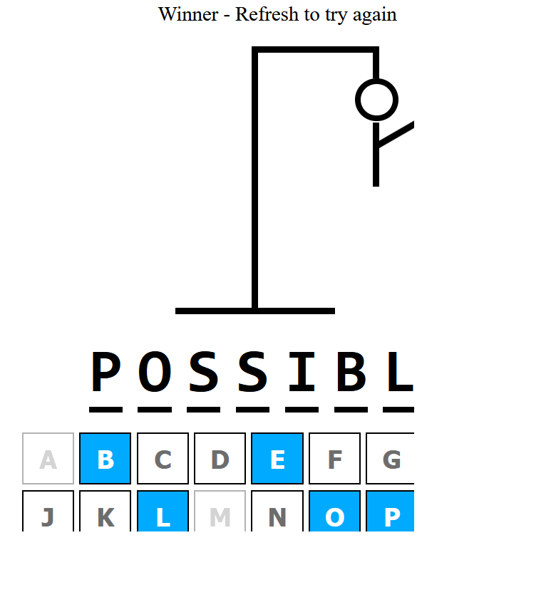
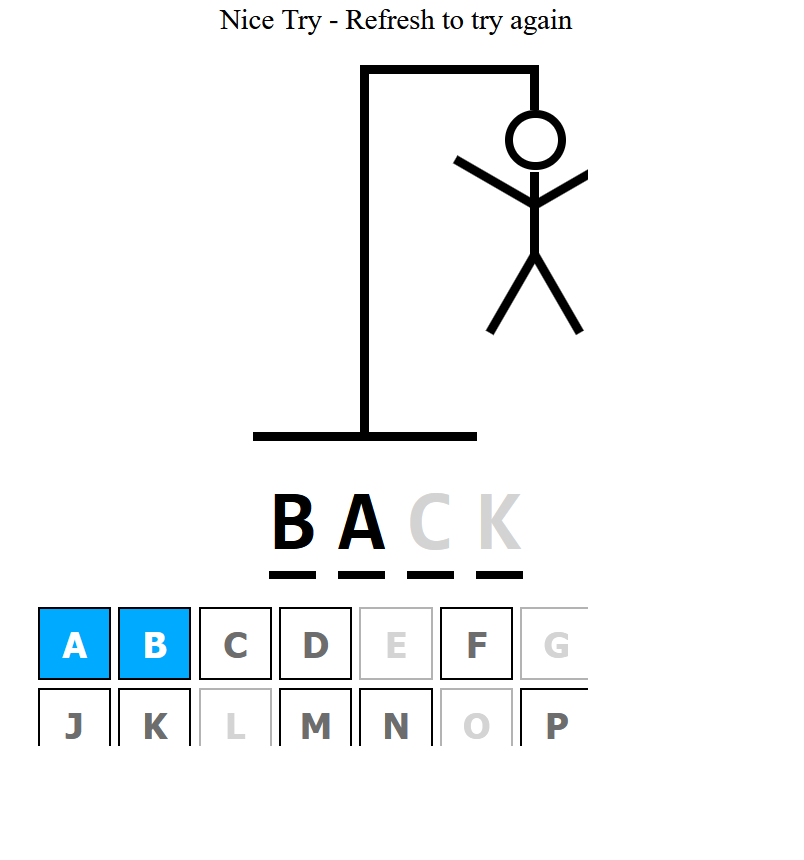

# Hangman Game

This game was developed using React + Typescript + CSS.

This project has easy logic-wise, but still includes many complicated problems to solve. As you're filling out different
letters in if you guess the word you get a winner message and if you get the wrong word it'll just show you the correct word and all the letter you missed.
